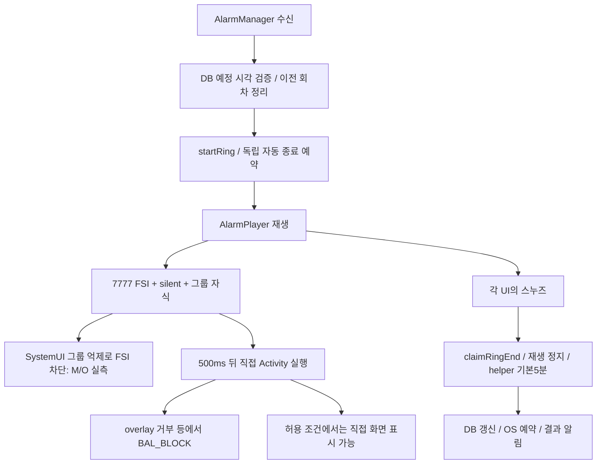
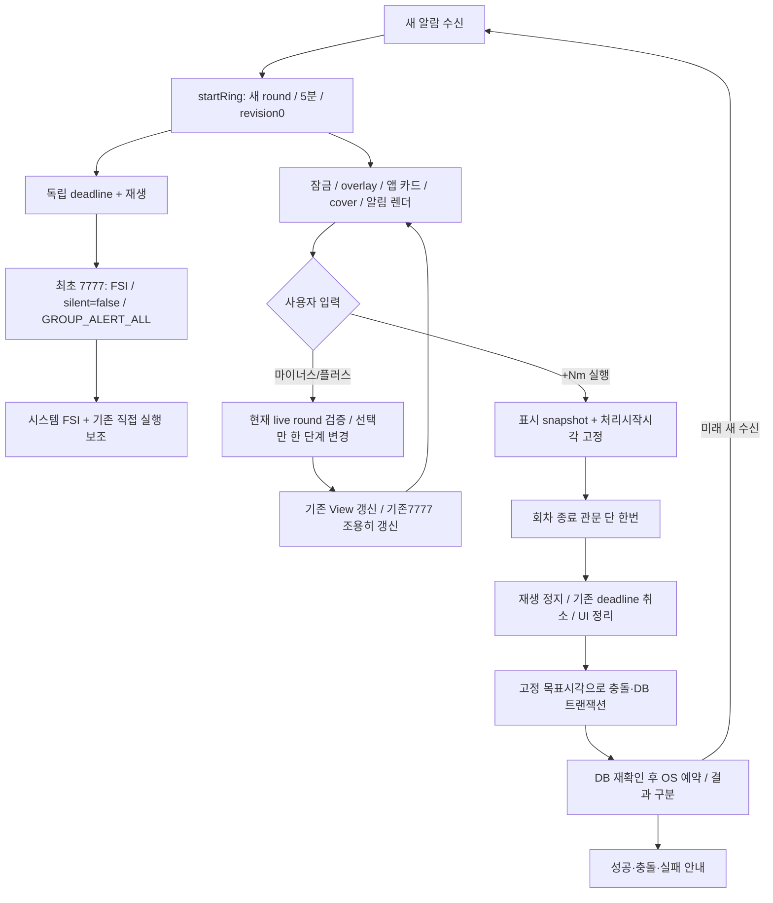

# 잠금 전체화면 P0 + 즉석 스누즈 구현 설계

> 2026-10-06 C 수정: 삼성 실측에서 발견한 안전영역·중복 화면·알림 분류·시스템 스누즈 문제를 수정했다. B의 “갱신에서 FSI 필드 제거/고정 untagged7777” 계약은 [C 수정 기록](삼성_FSI_즉석스누즈_C수정_2026-10-06.md)의 “최초 전용 토큰 폐기 후 메타데이터 유지/회차별 tag” 계약으로 대체된다. 기존 기록은 삭제하지 않고 C 결과를 별도로 연결한다.


작성: 2026-10-06 KST. 상태: **설계 완료 / 구현·테스트·빌드·기기 검사 NOT_RUN**.

후속 연결: 위 상태는 설계 작성 시점 기록이다. 이후 사용자 승인으로 시작한 구현·검사는 [구현 원장](FSI_즉석스누즈_구현_2026-10-06.md), 기기 연결 후 시작점은 [삼성 검사 준비](교대시계_최신문서.txt), 그 다음 개발 항목은 [시간대 종료 알람 재생성 방지](교대시계_최신문서.txt)를 따른다.

이 문서는 현재 작업본을 읽고 작성한 후속 설계 원장이다. 제품 코드의 수정 지시를 실행한 결과가 아니다. 구현 착수에는 사용자의 별도 구현 지시가 필요하다. 유료 기기뿐 아니라 이번 설계 중 모든 기기 연결·조작을 하지 않았다.

## 0. 구현자가 먼저 알아야 할 결정

1. 최초 울림 7777은 **기존 그룹을 유지하고 `setSilent(false)` + `GROUP_ALERT_ALL`**로 게시한다. FSI를 붙이는 것은 새 회차의 최초 게시뿐이다. 그룹 분리는 기본안이 아닌, 실제 그룹 관련 실패가 남았을 때의 대안이다.
2. 선택 시간·언어·홈 이탈·커버 전환에 따른 갱신은 **FSI 없는 조용한 갱신**이다. 최초 게시와 같은 기본 인자 함수를 재사용하지 않는다.
3. 즉석 스누즈 선택값은 `RingingAlarmTracker`가 **(alarmId, round)**와 함께 소유한다. 각 화면의 독립 변수나 사용자 전역 설정으로 만들지 않는다. 새 회차마다 5분, 5분 단위, 최대 30분이다.
4. `−/+`는 선택 상태와 표시만 변경한다. 재생·진동·DB 알람 행·OS 예약·회차·자동 종료 기한을 바꾸지 않는다.
5. 실행은 **눌린 버튼에 표시됐던 분 값**을 고정해서 공통 처리한다. 여러 화면 사이에 잠깐 오래된 표시가 남아 있어도 “+15m을 눌렀는데 30분 예약”이 되면 안 된다.
6. 알림창은 `DecoratedCustomViewStyle`의 펼친 커스텀 내용에 조절부, 표준 액션 두 개에 실행/끄기를 둔다. 네 개의 표준 액션이나 MediaStyle로 우회하지 않는다.
7. 기존 충돌 정책은 유지한다. 목표 시각과 **동일한 절대 분**에 다른 알람이 있으면 현재 울림만 종료하고 다른 알람을 유지하며 이를 알린다. “선택 시간 뒤 재울림”에는 이 기존 예외와 예약 실패 예외가 있음을 숨기지 않는다.
8. 예약 결과를 성공·충돌·DB 실패·OS 실패·더 최신 변경으로 구분한다. OS 실패를 성공 문구로 표시하는 현재 동작은 고친다.
9. P0만 반영한 기준점 A와 스누즈까지 반영한 기준점 B를 남긴다. 하나의 개발 요청으로 구현할 수 있어도 두 기준점의 검사를 합치지 않는다.
10. 실기기 검증 전 상태는 **구현 검증 완료 / 실기기 미검증**까지다. 삼성 기존 PASS를 새 APK에 상속하지 않는다.

## 1. 범위와 근거

### 1.1 읽은 원장 및 보존 조건

- [AGENTS.md](../../AGENTS.md)
- [유료 실기기 최종 검토](후속재점검_2026-10-05/유료실기기_최종검토_2026-10-06.txt)
- [권한 P0 회귀 기준](후속재점검_2026-10-05/권한_P0_회귀기준.txt)
- 기존 1·2·3차 검토 원장과 기존 미커밋 작업을 유지한다. 이 설계서를 기존 검토 원장의 PASS 수정 근거로 쓰지 않는다.
- 작업본에는 다국어·지역 시간·권한·화면 등의 기존 변경이 많다. `git reset`, 파일 단위 checkout, 전체 파일의 과거 버전 복원으로 이를 지우지 않는다.
- 코드 검색에서 확인한 스누즈 실행부는 모두 native Kotlin이다. Flutter 앱 안의 울림 카드도 `InAppAlarmController`가 만드는 native Dialog다.

### 1.2 버전과 동결 산출물

| 항목 | 읽어서 확인한 내용 | 해석 한계 |
|---|---|---|
| 검사 APK | `build/paid_devices_2026-10-06/tested-dev-release.apk` | 현재 작업본 전체와 동일하다는 뜻은 아님 |
| APK 식별 | 최종 원장 기록: `com.hwani1103.shiftbell.dev`, 1.0.23-dev, SHA256 `d4d99b11ec120de36961585551928e97f070f146b54e020f58f510d586130cf6` | APK 해시는 이번 설계에서 다시 계산하지 않음 |
| 실제 Core 버전 | APK ZIP의 `META-INF/androidx.core_core.version`, `androidx.core_core-ktx.version` 모두 **1.17.0**을 직접 읽음 | 선언 버전이나 캐시에 존재하는 최고 버전을 추측한 것이 아님 |
| 작업 디렉터리의 기존 빌드 기록 | `build/app/outputs/logs/manifest-merger-dev-release-report.txt`: core/core-ktx 1.17.0 | 의존성을 새로 해석하거나 빌드하지 않음 |
| SDK | `android/app/build.gradle.kts`: compile/target 36, min은 Flutter 값. 기존 merged manifest min 24 | 다음 구현 시 실제 해석 결과를 다시 기록 |
| Robolectric | 4.14.1, 공통 `robolectric.properties`는 SDK 34 | SDK 36 실기기 검증 대체 불가 |
| NotificationHelper 현재 SHA256 | `f1d737a8e07532d55d193117d28374029de7bbbd998e3f59ec471e86c3aed268` | 원장에 기록된 검사 시 소스 해시와 일치 |

Core 1.17.0의 로컬 `classes.jar`에서 `NotificationCompatBuilder.class`를 임시 디렉터리에 추출해 `javap -c -p`로 읽었다. 제품 빌드가 아니다. class 파일 직접 검사 최종 exit=0. 확인한 생성자 바이트코드는 다음 의미다.

```text
builder.mSilent == true이면:
  groupSummary == true -> groupAlertBehavior = 2
  groupSummary == false -> groupAlertBehavior = 1
  sound/vibrate/defaults를 무음으로 설정
  API >= 26:
    그룹 키가 비었으면 "silent" 그룹을 자동 설정
    계산한 groupAlertBehavior를 platform Builder에 다시 적용
```

따라서 **`setSilent(true)`를 유지한 채 `setGroupAlertBehavior(ALL)`만 추가하거나 호출 순서만 바꾸는 해결책은 채택하지 않는다.** 생성 단계에서 덮어쓴다. 그룹만 지우는 해결책도 silent 자동 그룹 때문에 충분하지 않다.

### 1.3 사실·가설·미검증 구분

| 구분 | 판단과 증거 |
|---|---|
| 확인된 사실 | Motorola G34/A14, OPPO A38/A14의 7777에 FSI가 있고 중요도4, groupAlertBehavior=1. SystemUI가 `NO_FSI_SUPPRESSIVE_GROUP_ALERT_BEHAVIOR`를 기록 |
| 확인된 사실 | 같은 회차의 직접 Activity 실행은 `BAL_BLOCK`, result=102 |
| 확인된 사실 | 현재 7777 builder에 silent=true, 공통 group, summary=false가 함께 있음. Core 1.17.0 구현은 그 조합으로 그룹 억제를 만듦 |
| 설계 결론 | 적어도 M/O에서 확인된 FSI 차단 사유는 앱 알림 구성의 결함이다. 그 차단 사유를 제거하는 수정은 필요 |
| 아직 미검증 | 수정 후 OS가 실제로 FSI를 실행하고 잠금 끄기·스누즈까지 정상일지는 새 APK 실기기 검사 필요 |
| 강한 가설 | Xiaomi의 같은 조건 실패에도 이 구성이 기여할 수 있음. 해당 SystemUI 경고는 Xiaomi 기록에서 확정하지 않음 |
| 미확정 | 삼성 정상 회차가 FSI인지 직접 실행인지, 각 삼성 회차의 정확한 권한 조합. 삼성 전체 ROM 정상으로 일반화하지 않음 |
| 별도 문제 | Infinix의 정시/자연 스누즈 재수신 관찰 실패는 수신·시각·시험 환경 문제가 섞여 있음. 7777 구성 수정으로 해결 판정 금지 |

직접 읽은 로그 예:

- `build/paid_devices_2026-10-06/motorola/systemui_fsi.log:2`
- `build/paid_devices_2026-10-06/motorola/fsi_activity_logs.txt:141`
- `build/paid_devices_2026-10-06/oppo/first_ring.log:186`, `:190`
- `build/paid_devices_2026-10-06/oppo/notification_ring.txt`의 7777 항목
- Xiaomi 로그는 여러 회차의 출력이 누적돼 있으므로 파일명에 `all_allowed`가 있다고 모든 줄을 허용 조건의 새 사건으로 분류하지 않는다. 최종 원장의 시각·권한별 판정을 기준으로 대조한다.

### 1.4 공식 근거

- [SystemUI FSI 그룹 억제 판정](https://android.googlesource.com/platform/frameworks/base/+/af8e64dbf089/packages/SystemUI/src/com/android/systemui/statusbar/notification/interruption/NotificationInterruptStateProviderImpl.java): 그룹 억제 검사가 화면 꺼짐·잠금 상태에 따른 실행 판정보다 앞선다. OEM 전체 구현이 이 파일과 같다는 주장은 하지 않는다.
- [NotificationCompat.Builder](https://developer.android.com/reference/androidx/core/app/NotificationCompat.Builder): silent, group alert behavior, custom content, onlyAlertOnce 계약 참고. 실제 1.17.0 동작은 위 로컬 바이트코드로 보강했다.
- [커스텀 알림](https://developer.android.com/develop/ui/views/notifications/custom-notification): RemoteViews, DecoratedCustomViewStyle, 시스템 장식 및 작은 높이 제한. 완전히 자유로운 앱 화면이 아니다.
- [알림 액션 구성](https://developer.android.google.cn/design/ui/mobile/guides/home-screen/notifications?hl=en): 일반 확장 알림의 표준 액션은 최대 세 개. 본 설계는 두 개만 사용한다.
- [NotificationChannel](https://developer.android.com/reference/android/app/NotificationChannel): 기존 채널의 사용자 소리·진동·중요도 설정을 앱이 재생성 호출로 강제 초기화한다고 가정하지 않는다.
- [PendingIntent](https://developer.android.com/reference/android/app/PendingIntent): extras는 identity에 포함되지 않는다. IMMUTABLE도 생성자가 UPDATE_CURRENT로 기존 토큰의 extras를 갱신하는 문제까지 막지 않는다.

## 2. 현재 구조에서 반드시 보존할 것

아래의 Kotlin 경로 접두사는 `android/app/src/main/kotlin/com/hwani1103/shiftbell/`이다.

| 파일·진입점 | 현재 동작 / 변경 시 주의 |
|---|---|
| `CustomAlarmReceiver.onReceive` | 수신 시 DB 예정 시각 검증 → 이전 울림 정리 → `startRing` → 독립 자동 종료 → 재생 → 7777 → 화면 깨우기 → 500ms 뒤 화면/오버레이 → 650ms 뒤 커버 추적 |
| `NotificationHelper.showRingControlNotification` | FSI·탭·삭제·스누즈·끄기 PI 생성. HIGH 채널, legacy 제어 채널 fallback, 커버 LOW 채널. `launchFullScreen=true` 기본값이 재게시에도 적용될 수 있음 |
| `AlarmActivity` | 일반 잠금 화면과 커버 화면 모두 소유. `onUserLeaveHint` 재게시가 현재 기본 FSI=true를 사용. 커버 해제 복원은 FSI=false |
| `AlarmOverlayService` | `overlay_alarm.xml` 표시. 스누즈에서 종료 관문 통과 → stop → DB/OS 예약. 외부 `snoozeOverlay` 신호는 DB 예약을 하는 함수가 아님 |
| `InAppAlarmController` | 같은 overlay XML로 Dialog. 같은 회차·언어면 `reconcile` 조기 반환하므로 숫자만 갱신하는 별도 경로 필요 |
| `CoverAlarmLayout.create` | 현재 두 버튼과 +5m 하드코딩. 좁은 화면/카메라·시스템 inset 대응 유지 필요 |
| `CoverAlarmDisplay.followRing` | 화면 접힘/펼침에 따라 Activity를 다른 display로 옮김. 선택값을 View나 Activity에만 두면 초기화됨 |
| `AlarmActionReceiver` | 알림과 앱 카드 실행의 입구. 회차 검사 후 재생 정지·UI 정리·helper 호출 |
| `AlarmActionHelper.snooze` | minutes 인자를 이미 받음. 동일 절대 분 충돌 처리, DB 트랜잭션 후 OS 예약, offset 날짜 저장. 현재 OS FAILED여도 결과 객체를 반환해 성공 문구 가능 |
| `RingingAlarmTracker` | DPS prefs의 ID/round/counter와 프로세스 메모리. 모든 시작·종료는 lock 사용. `activeStartedHere`, 복원용 epoch/endingIds, commit 실패 fallback 존재 |
| `RingTimeoutController` | 프로세스 공통 elapsed deadline. 화면 재생성으로 다시 시작하면 안 됨 |
| `AlarmWakeScheduler` | setAlarmClock, DB 재확인, stale 거부, 실패 ID 재시도. 정확 권한 거부 시 비정확 fallback을 시도하나 결과는 FAILED |
| `NotificationLocale` | 기존 알림을 복제해 silent=true/FSI=null, ring은 BigTextStyle과 고정 5분 문구로 재구성. 새 커스텀 뷰를 이 경로에 그대로 넣으면 손상됨 |

`MainActivity`의 `snoozeOverlay` MethodChannel은 앱 코드 검색상 현재 Dart 호출자가 없고, overlay 쪽 주석상 외부에서 DB 처리를 마친 뒤 창을 닫는 과거 신호다. 이를 새 사용자 스누즈 실행 입구로 재사용하지 않는다. 새 UI는 공통 controller만 사용한다. 과거 신호 정리는 별도 변경이다.

### 2.1 현재 흐름



## 3. 전체화면 P0 최종 권장안

### 3.1 대안 비교와 선택

| 대안 | 평가 | 결정 |
|---|---|---|
| silent 유지 + ALL만 추가 | Core 생성 단계가 다시 SUMMARY로 덮어씀 | 제외 |
| 그룹만 제거 + silent 유지 | API26+ 자동 silent 그룹 생성 | 제외 |
| **최초 silent=false + 기존 group + ALL** | 확인된 억제 원인 제거. 기존 삼성 그룹·category·localOnly·스타일을 단계 A에서 보존 | **기본안** |
| 최초 silent=false + 그룹 제거 | 억제 원인 제거 가능. 사전/결과 알림과 분리되지만 알림 외형·정렬·삼성 회피 설정까지 변경 | 그룹 유지안이 실제 그룹 문제를 남길 때 대안 |
| 그룹 summary=true 전환 | 의미가 달라지고 다른 알림까지 묶음/제어 위험 | 제외 |
| overlay 필수 요구 또는 직접 실행만 강화 | FSI 구성 결함이 남고 권한 거부 사용자의 정상 경로를 복구하지 못함 | 제외 |
| Samsung만 기존 코드 유지 | Samsung에도 같은 경로 결함이 가려져 있을 수 있음. 검증 없이 브랜드 하드코딩 금지 | 제외 |

**판단의 강도:** Core 출력에서 억제가 제거된다는 근거는 충분하다. 이것이 모든 OEM에서 실제 FSI 성공을 보장한다는 근거는 없다. 그 차이는 실기기 검사로 해소한다.

### 3.2 최초 게시 / 조용한 갱신 계약

`launchFullScreen: Boolean = true`처럼 기본값에 의존하는 API 대신 목적을 명시한다.

```kotlin
enum class RingNoticeReason {
    START, SELECTION, LOCALE, USER_LEAVE, COVER_ENTER, COVER_EXIT
}
enum class RingNoticeSurface { STANDARD, COVER }

// START는 CustomAlarmReceiver만 호출. 다른 곳은 목적에 맞는 update/ensure 함수 사용.
fun postInitialRing(context, ring, label, durationMinutes): PostResult
fun refreshExistingRing(context, ring, reason): PostResult
fun ensureRingControls(context, ring, reason): PostResult
```

| 속성 | 최초 START, 일반 화면 | 선택/언어/홈 등 일반 갱신 | 커버 제어 |
|---|---|---|---|
| FSI | 회차의 screen PI | null | null |
| silent | false | true | true |
| groupAlertBehavior | ALL(0) | silent에 의해 SUMMARY(1)이어도 정상 | 동일 |
| group / summary | 기존 group / false | 유지 | 유지 |
| priority/category | HIGH / CALL | HIGH / CALL | LOW / STATUS |
| 채널 | 기존 `shiftbell_alarm_v3`, 기존 legacy fallback 보존 | 현재 실제 채널 유지 | 기존 `shiftbell_cover_controls` |
| onlyAlertOnce | true | true | true |
| sound/vibrate/defaults | API24~25도 자체 소리 없음이 명시되도록 null/null/0 | 조용한 갱신 | 조용한 갱신 |
| when | 회차의 최초 게시 시각 | 그대로 유지 | 그대로 유지 |
| content/delete/actions | 회차에 바인딩 | 동일 회차 + 최신 선택 표시 | 동일 |

갱신에 silent=true를 쓰는 것은 의도적이다. **FSI가 없는 갱신을 억제하는 것과, 최초 FSI를 억제하는 것은 다르다.** 모든 setSilent를 전역 검색·삭제하지 않는다. 8888/8889 등은 그대로 조용히 남는다.

API26+ 최초 알림 소리·진동은 채널 설정이 결정한다. 기본 채널은 무음/무진동이지만, 사용자가 채널 소리·진동을 바꾼 설치에서 추가 효과가 발생할 수 있다. 사용자 설정을 덮거나 새 채널로 우회하지 않는다. 갱신에서는 silent=true로 추가 효과를 억제한다. 이 잔여 위험을 삼성/기존 설치 시험에 넣는다.

### 3.3 게시 순서와 경합 방지

- 모든 울림 UI 제어와 7777 게시를 메인 스레드에서 직렬 처리한다. `RingingAlarmTracker`의 lock은 시작/종료/선택의 원자적 판정에 사용한다. lock 안에서 DB/OS 장시간 작업, UI listener 호출을 하지 않는다.
- 최초 게시 전에 현재 회차를 확인한다. 7777이 다른 회차의 잔재인 경우에만 새 회차 시작 정리에서 제거한다. 같은 회차의 숫자 변경에 cancel→notify를 사용하지 않는다.
- `START` 게시 기회는 회차당 한 번이다. 실패해도 임의의 반복 FSI 재시도 루프를 만들지 않는다. 제어 알림 보충은 FSI 없는 ensure로 수행하고 실패를 기록한다.
- `SELECTION`/`LOCALE`은 이미 게시된 동일 회차 알림만 갱신한다. 알림이 없으면 새 알림을 만들지 않는다. 특히 종료 직후 지연된 갱신으로 7777이 부활하면 안 된다.
- 사용자 홈 이탈에 한해 `ensureRingControls(USER_LEAVE)`로 현재 살아 있는 회차의 누락 제어 알림을 보충할 수 있다. FSI는 항상 null이다.
- 커버 진입/이탈에서 기존 채널 변경을 위한 cancel→notify가 필요하면 그 전환에서만 한다. 선택 갱신은 현재 surface/channel을 유지한다. 늦게 도착한 이전 display 이벤트는 generation/실제 현재 display를 확인해 무시한다.
- Android에 `notify`가 정상 반환된 사실은 표시 성공이 아니다. 기록을 `posted/requested`와 `AlarmActivity.onResume에서 관찰한 표시`로 구분한다.

**최초 FSI 평가 전 갱신 주의:** 언어 갱신이 최초 FSI 게시 직후 들어와 곧바로 null로 교체하면 시스템 평가 전에 FSI를 없앨 수 있다. `INITIAL_POSTED`와 `INTERACTION_OR_PRESENTED` 상태를 분리한다. 다음 중 하나를 관찰한 뒤 비필수 LOCALE 갱신을 허용한다: 해당 회차 AlarmActivity/overlay/in-app 표시 완료, 알림의 조절/실행/탭 같은 실제 사용자 입력, 해당 화면의 홈 이탈. 이전에는 최신 언어 요청만 보류한다. 고정 500ms/1초 대기로 표시됐다고 추정하지 않는다. 화면 표시 없이 FSI도 실패했다면 해당 회차의 자동 문구 갱신은 보류될 수 있으며 다음 실제 조작/새 회차에 반영한다.

### 3.4 직접 Activity 실행과 중복 인스턴스

- 단계 A에서는 현재 500ms 직접 실행 보조 경로와 커버 추적을 제거하지 않는다. FSI 복구와 직접 실행 제거를 동시에 하면 기존 삼성 fallback을 잃을 수 있다.
- `visibleRing` 검사 유지. 콜백 시점에 현재 회차와 잠금 상태를 다시 확인한다. 500ms 전에 읽은 잠금 상태만으로 선택하지 않는다.
- FSI와 직접 실행이 경합해 `singleTask`에 새 Intent가 오면 `AlarmActivity.onNewIntent`에서 **같은 회차는 타이머·선택·재생을 초기화하지 않는다.** 오래된 회차 Intent는 무시한다. 다른 살아 있는 회차는 새 표시 데이터로 재바인딩하고 남은 독립 기한만 사용한다.
- 선택/언어 갱신에서는 Activity, wake lock, `wakeUpScreen`, overlay service 시작을 호출하지 않는다.
- 직접 startActivity의 반환/무예외를 성공 로그로 쓰지 않는다. `onResume`, displayId, 회차, keyguard 상태 로그로 실제 표시를 확인한다.
- 보조 경로 제거는 이번 완료 요건이 아니다. 실제 FSI 경로 성공을 별도로 관찰하고, 필요하면 후속 변경으로 판단한다.

## 4. 즉석 스누즈 상태와 명령

### 4.1 상태 소유권

선택 상태는 별도 global preference가 아니라 `RingingAlarmTracker`의 기존 lock과 생명주기에 넣는다. `ActiveRing`의 equality 의미는 유지하고 별도 스냅샷을 제공한다.

```kotlin
data class SnoozeSelection(
    val ring: ActiveRing,
    val minutes: Int,          // 5,10,15,20,25,30
    val revision: Long         // 회차 내 표시 버전, 0부터
)
const val DEFAULT_SNOOZE_MINUTES = 5
val ALLOWED_SNOOZE_MINUTES = setOf(5, 10, 15, 20, 25, 30)

fun selectionForLiveRing(context, ring): SnoozeSelection?
fun adjustSnooze(context, ring, deltaSteps: Int): AdjustResult
// deltaSteps는 -1 또는 +1만 허용. 범위 밖 값을 clamp해서 명령처럼 실행하지 않음.
```

- `startRing`: counter 증가와 같은 임계 구역에서 minutes=5/revision=0, DPS `alarm_state`에 같은 editor로 저장한다. `ActiveRing` 비교는 ID+round만 유지한다.
- 조절: 현재 살아 있는 회차인지 확인 → 5분 변화 → 5/30 경계에서는 상태 변화 없음 → 실제 변화 시 revision 증가 → 저장. DB 행과 restore epoch/endingIds는 건드리지 않는다. 선택은 복원 이월 여부를 바꾸는 데이터가 아니다.
- 종료: `endIfCurrent`에서 선택 키도 함께 지운다. `ring_counter`는 지우지 않는다. 이미 종료된 회차의 이벤트는 no-op이다.
- 저장 키 예: `ring_snooze_minutes`, `ring_snooze_revision`. 유효한 active ID/round에만 붙는 값이다. 독립 alarmId 전역값으로 복원하지 않는다.
- 기존 버전의 active에 선택 키가 없거나 저장값이 손상되면 5/0을 읽되, 저장값만으로 살아 있는 울림을 새로 만들지 않는다.
- 기존 commit 2회 재시도/메모리 fallback 원칙을 유지한다. 실패를 로그에 남기며, 다른 저장 경로로 선택값을 이중 소유하지 않는다.
- 화면 재생성·홈 복귀·접힘/펼침은 현재 selection을 다시 구독한다. `startRing`을 호출하지 않는다.
- 실제 프로세스 재시작: 저장된 active는 `activeStartedHere=false`다. 선택값을 읽었다고 재생·자동 종료·FSI·살아 있는 조절 UI를 재시작하지 않는다. 새 수신으로 `startRing`이 호출되면 새 round/5분이다.
- 새 형식의 조절·스누즈 명령은 live 회차에만 허용한다. 이전 프로세스 잔재 알림은 현재 다른 회차를 손대지 않고 정리/만료 안내한다. 기존 legacy round 매핑은 별도 호환 분기로 유지한다.

### 4.2 공통 UI controller

새 `RingSnoozeController.kt`를 두어 조절·실행·표시 통지를 모은다. 예약 DB 처리는 계속 `AlarmActionHelper`가 소유한다.

```kotlin
data class SnoozeClick(
    val ring: ActiveRing,
    val displayedMinutes: Int,
    val displayedRevision: Long,
    val acceptedWallMillis: Long,
    val acceptedElapsedMillis: Long
)

fun adjust(context, ring, deltaSteps): AdjustResult
fun execute(context, click): SnoozeExecution
fun observe(ring, observer): Subscription
```

메인 스레드 controller의 명령 순서가 사용자 UI 동작의 순서다. 관찰 통지는 lock 밖에서 하고 listener가 등록한 화면 생명주기에 맞춰 제거한다. Activity/Service를 전역 강한 참조로 보관하지 않는다. View를 다시 inflate하거나 Dialog를 dismiss/show하지 않고 기존 TextView·버튼 상태만 바꾼다.

`InAppAlarmController.reconcile`의 동일 회차 조기 반환 전 `renderSelection`을 호출하거나 별도 selection observer를 둔다. `changed()`만 호출하고 기존 조기 반환에 맡기면 숫자가 갱신되지 않는다.

### 4.3 표시와 실행의 일치

각 렌더러는 마지막으로 그린 `SnoozeSelection`을 `boundSnapshot`으로 가진다. 숫자와 실행 listener를 같은 메인 스레드 작업에서 함께 바꾼다.

- 실행 직전에 global minutes를 새로 읽어서 예약하지 않는다.
- 실행 명령은 **해당 버튼에 바인딩된 minutes**를 사용한다.
- 동일 회차의 오래된 15분 버튼이 잠깐 남아 있는 동안 다른 화면은 20분이 됐어도, 그 15분 버튼을 눌렀으면 15분을 예약한다. 이는 “표시된 동작 그대로 실행”을 선택한 명시적 경합 정책이다.
- round가 오래됐으면 무조건 거부한다. minutes가 허용 집합 밖이면 거부한다. revision은 진단/갱신 순서 확인용이며, 같은 회차에서 revision이 낮다는 이유로 표시됐던 실행 시간을 다른 값으로 바꾸지 않는다.
- `−/+`는 각 입력을 현재 선택에 대한 한 단계 변화로 직렬 적용한다. 빠른 두 번의 +가 같은 오래된 RemoteViews에서 발생했더라도 두 단계 증가한다. 경계에서는 no-op이다. 자동 반복 long-press는 구현하지 않는다.
- notification 갱신은 최신 revision만 게시한다. 이전 비동기 렌더 완료가 최신 값 위에 덮이지 않게 한다. observer 또는 한 번의 다음 메인 루프 작업으로 합칠 수 있으나 DB 작업을 포함하지 않는다.

### 4.4 Intent / PendingIntent 계약

현재 `AlarmActionReceiver`가 `exported=false`, `directBootAware=true`인 구조를 유지한다. 새 exported receiver나 permission을 추가하지 않는다.

| 용도 | action / data URI 예 | 값 |
|---|---|---|
| 감소 | `com.hwani1103.shiftbell.ADJUST_SNOOZE` / `shiftbell://ring-control/v2/{id}/{round}/{revision}/minus` | id, round, deltaSteps=-1 |
| 증가 | 같은 action / `.../{revision}/plus` | id, round, deltaSteps=1 |
| 실행 | 새 `com.hwani1103.shiftbell.SNOOZE_SELECTED` / `.../{revision}/snooze/{minutes}` | id, round, minutes, revision, protocol=2 |
| 끄기 | 기존 dismiss action / 기존 round URI 유지 가능 | id, round |
| 본문 탭/FSI | 기존 screen URI, Activity 직접 PI | id, round, label, duration |

- 모든 PI는 명시적 component + `FLAG_IMMUTABLE`. 실행 PI의 identity에 minutes/revision이 포함되므로 같은 ID·round의 예전 버튼을 UPDATE_CURRENT로 다른 분으로 바꾸지 않는다.
- data와 extras가 불일치하는 새 명령은 거부하고 로그만 남긴다. 잘못된 값은 5분으로 몰래 실행하지 않는다.
- requestCode 산술만으로 구별하지 않는다. URI/action/component가 구별의 기준이다.
- 명령 수신기는 클릭 처리 시작 시각을 잡는다. 알림 게시 때 미래 클릭 시각을 extras에 넣지 않는다.
- 새 PI를 만들 때 이전 회차 PI를 새로운 회차로 retarget하지 않는다. 기존 G1RingRoundTest의 오래된 토큰 보호를 확장한다.
- 이전 앱이 만든 `SNOOZE_FROM_NOTIFICATION`(minutes 없는 구형 action)은 기존 round 정규화 범위에서만 고정 5분으로 처리한다. 새 UI에서는 이 구형 action을 만들지 않는다. 새 action의 extras 누락을 구형으로 취급하지 않는다.
- 알림 조절/실행은 BroadcastReceiver에서 바로 명령을 처리한다. broadcast에서 Activity를 다시 열어 실행하는 trampoline을 만들지 않는다.

### 4.5 변경 후 흐름



## 5. 예약 처리의 정확한 계약

### 5.1 시간 계산

현재 helper는 DB 조회 뒤 `System.currentTimeMillis()`를 읽는다. 새 API는 UI click/Receiver 진입 즉시 읽은 시각을 받는다.

```kotlin
val delayMs = displayedMinutes.toLong() * 60_000L
val rawTarget = Math.addExact(acceptedWallMillis, delayMs)
// DB/예약의 초 정밀도는 유지하되 선택 시간보다 일찍 울리지 않게 초 올림.
val targetAt = Math.addExact(AlarmWakeScheduler.normalize(rawTarget),
    if (Math.floorMod(rawTarget, 1000L) == 0L) 0L else 1000L)
```

- `targetAt`은 한 번만 계산하고 충돌 검사, DB `date`, OS expectedAt, 성공 문구에 같은 값을 전달한다.
- 현재 `normalize`는 초 내림이어서 최대 999ms 앞당길 수 있다. 스누즈 목표만 위처럼 올림한다. 전체 scheduler의 normalize 의미는 변경하지 않는다.
- 09:00:12.450에 +15m 처리 시작 → 09:15:13.000 예약. DB·OS 모두 같은 값. 계산상의 허용 오차는 0~999ms 늦음이며 실제 OS 전달 지연은 별도다.
- 잠금 알림의 RemoteViews에서는 물리적인 터치 시각을 앱이 직접 받을 수 없다. receiver 콜백 시작을 기준으로 한다. 이 차이를 “물리적 터치 순간과 0ms 일치”로 주장하지 않는다.
- `acceptedElapsedMillis`는 처리 지연/시험 로그 용도다. 이번 작업은 모든 알람을 ELAPSED_REALTIME 예약으로 바꾸는 작업이 아니다.
- 날짜 경계·월/연 경계는 epoch 덧셈으로 넘긴다. `AlarmInstant.format`의 offset 날짜와 `AlarmInstant.display`의 DST 겹친 시각 구분을 유지한다. 문자열 `HH:mm` 덧셈, 분 단위 절삭, 임의의 1분 밀기는 금지한다.
- 사용자/OS가 대기 도중 벽시계를 변경하면 기존 RTC 기반 동작이 적용된다. 시계 변경에도 정확히 실경과 N분을 보장하는 별도 재설계는 이번 범위가 아니다.

### 5.2 실행 함수 및 결과

```kotlin
sealed interface SnoozeExecution {
    data object IgnoredStale : SnoozeExecution
    data object InvalidInput : SnoozeExecution
    data class Scheduled(val alarmId: Int, val targetAt: Long,
                         val timeText: String, val shiftType: String) : SnoozeExecution
    data class Collision(val alarmId: Int, val targetAt: Long,
                         val message: String) : SnoozeExecution
    data class DbFailed(val alarmId: Int, val reason: String) : SnoozeExecution
    data class OsFailed(val alarmId: Int, val targetAt: Long) : SnoozeExecution
    data class Unverified(val alarmId: Int, val targetAt: Long) : SnoozeExecution
    data class ExecutionFailed(val alarmId: Int, val stage: String) : SnoozeExecution
    data class Superseded(val alarmId: Int) : SnoozeExecution
}

// helper는 회차 종료/재생/finishTransition을 하지 않는다. DB/OS 결과만 돌려준다.
fun snoozeAt(context, alarmId: Int, targetAt: Long): SnoozeExecution
```

실행 의사코드:

```text
onSnoozeClick(boundSnapshot):
  acceptedAt = clock.now()                       // DB 열기 전
  validate(protocol, minutes, round)
  require current live round for v2
  targetAt = ceilToSecond(acceptedAt.wall + minutes * 60_000L)
  if !claimRingEnd(id, round): return IgnoredStale
  // 위 관문은 그대로 timeout 취소·endingIds/epoch 처리를 담당
  try:
    stopAlarm()
    closeRingUi(id)                              // 결과8889를 내기 전에 정리
    result = AlarmActionHelper.snoozeAt(id, targetAt)
  catch exception:
    result = ExecutionFailed(id, stage)          // stop/cleanup 예외를 DB 실패로 오인하지 않음
  finally:
    finishTransition(id)                        // 성공/실패/예외 모두 한 번
  publishOutcome(result)                        // Scheduled만 성공 문구
```

**새 실행 경로에서는 controller의 위 finally 하나가 finishTransition을 소유한다.** `AlarmActionHelper.snooze`의 기존 finally를 새 `snoozeAt`에 복사하지 않는다. 제품의 새/legacy 스누즈 입력 모두 controller를 거쳐 같은 종료 책임을 갖는다. 기존 테스트에서 helper를 직접 호출하는 부분은 DB/OS 전용 `snoozeAt` 검사와 실제 controller 종료 검사로 나눈다. 과도기 호환 wrapper를 남겨야 한다면 controller에서 그 wrapper를 호출하지 않는다. 같은 이유로 UI별 stop/DB 호출/7777 취소 코드를 남기지 않는다.

`AlarmPlayer.stopAlarm`은 현재도 MediaPlayer stop/release와 vibrator cancel을 각각 보호한다. 이 구조를 보존한다. 예외를 주입한 검사에서는 한 정리 작업의 실패가 다른 정리 작업까지 생략하게 하지 않는다. 정지/정리 자체가 실패하면 성공 결과를 내지 않고 `ExecutionFailed`로 기록한다. `closeRingUi` 이후 다시 UI 쪽에서 8889를 취소하는 기존 후처리를 남기면 방금 게시한 성공/실패 안내를 지울 수 있으므로 제거한다.

### 5.3 DB 충돌·트랜잭션

- helper의 알람 조회, 충돌 확인, 현재 행 변경과 이력 기록을 하나의 DB 트랜잭션 안에서 결정한다. 현재처럼 충돌 조회를 트랜잭션 밖에 두고 선택 시간을 확장하지 않는다.
- 다른 알람의 파싱한 절대 epoch를 `floorDiv(at, 60_000)`로 비교한다. 자기 ID 제외. DST 같은 시계 표기라도 다른 절대 분이면 충돌 아님. 오프셋 표기가 달라도 같은 절대 분이면 충돌이다.
- 충돌이면 상대 알람은 변경하지 않는다. 현재 알람만 기존 `snooze_skipped_existing_alarm` 결과로 종료한다. helper 내부에서 `dismissInternal`의 별도 nested transaction을 다시 여는 대신 공통 트랜잭션 내 삭제/이력 함수를 추출한다. 이력 한 번, OS 반영은 커밋 뒤다. 기존 dismiss의 `RestoreGate.clearRingSnapshot`, `cancelIfGone`, guard/Flutter refresh 등 부수 처리를 이 추출 과정에서 잃지 않는다.
- 여러 충돌 행이 있으면 실제 target epoch, id 순으로 안정적으로 대표 항목을 고른다. 다른 offset 문자열의 사전순 정렬을 시간순으로 사용하지 않는다.
- 충돌이 아니면 date=`AlarmInstant.format(targetAt)`, time=**targetAt을 현재 시간대에서 표현한 HH:mm**, type=`snoozed`; 기존 alarm_type_id, preset_slot, assigned_day, day_offset 등 의미를 보존한다. time에 버튼을 누른 현재 시각을 저장하지 않는다.
- 업데이트한 행 수가 0이면 성공으로 기록하지 않는다. 기록과 생성 이력은 동일 트랜잭션에서 한 번만 남긴다.
- `AlarmWakeScheduler.scheduleIfCurrent`를 커밋 후 호출한다. DB가 더 최신 시각으로 바뀌었거나 삭제됐다면 SKIPPED_STALE 결과를 `Superseded`로 처리한다. 옛 성공 알림을 게시하지 않는다.
- 현재 scheduler는 DB 재조회 실패 시 `scheduleUnverified`에서도 SCHEDULED를 반환하고 failedIds에는 ID를 남긴다. 따라서 SCHEDULED enum만 보고 확정 성공으로 표시하지 않는다. 반환 직후, `finishUp`의 재시도/방송을 시작하기 전에 failedIds도 읽어 해당 ID가 남으면 `Unverified`로 분류한다. 성공 안내는 SCHEDULED이며 미확인 ID가 없을 때만 한다. 이 작업을 위해 scheduler의 전체 enum/다른 예약 호출부를 일괄 재설계하지 않는다.
- 복원 보호의 active/endingIds/epoch/finishTransition 계약을 유지한다. 선택 조절은 복원 DB를 변경하지 않는다. 스누즈 실행은 기존처럼 현재 울림 행 이월 보호를 받는다. 모든 DB 작업에 일반적인 RestoreGate 거부를 추가해 사용자 종료 동작을 막지 않는다.

### 5.4 실패 및 프로세스 종료 정책

| 경우 | 확정 정책 |
|---|---|
| 잘못된 분/다른 회차 | stop·DB·OS·7777 취소 없음. 해당 오래된 View만 닫거나 최신 표시를 읽음 |
| 정상 claim 뒤 DB 없음/예외 | 울림은 사용자의 실행 요청대로 정지. 성공 표시 금지. 실패 메시지 + 진단 기록. 원본 DB 행을 임의로 새로 생성하지 않음 |
| DB 커밋 후 OS FAILED | 미래 snoozed 행과 기존 failedIds 재시도 유지. “정확한 재울림 예약을 확인하지 못했습니다” 안내. 비정확 fallback 시도만으로 성공 처리하지 않음 |
| SCHEDULED지만 DB 재확인 실패 ID가 남음 | `Unverified`. OS API 접수와 현재 DB 일치 확인을 구분하고 재확인 필요 안내. 미확인 목록 유지 |
| SKIPPED_STALE | 더 최신 DB 작업 존중. 기존 요청을 강제로 재예약하지 않음 |
| 앱/화면 재생성, 프로세스 유지 | 동일 회차 선택과 기존 deadline 사용 |
| 실제 프로세스 사망 | MediaPlayer도 종료. saved active로 소리를 재시작하지 않음. 이미 커밋된 미래 스누즈는 기존 복원·재조정 경로가 담당 |

실패 안내는 새 `SnoozeFeedback` helper로 모은다. 기존 결과 채널/8889를 이용한 별도 실패 내용 + Toast를 사용하되 7777로 실패 알림을 만들지 않는다. 실패 내용에는 request id/round와 원인을 진단 로그에 남긴다. 알림이 차단돼도 다음 앱 복귀에서 확인하도록 DPS에 **미확인 실패 사유 코드와 시각**을 저장하고 MainActivity가 한 번 사용자에게 알린 후 지운다. 원문 번역 문자열을 저장하지 않는다. 예약 실패 때문에 설정 화면을 자동으로 열지 않는다.

**남겨 두는 한계:** 현재 구조는 울림 종료 prefs와 SQLite·AlarmManager를 하나의 원자적 트랜잭션으로 묶지 않는다. claim/stop 직후 DB 커밋 전에 프로세스가 강제 종료되면 스누즈가 저장되지 않을 수 있다. 이번 기능에 별도 영속 명령 journal·DB 스키마 개편까지 넣지는 않는다. 이미 존재하는 이 간격을 “프로세스 사망에도 100% 예약”이라고 표현하지 않는다. 이 보장까지 필요하면 durable command journal과 restore 행 동일성 검사를 별도 설계·검증해야 한다. 정상 프로세스 실행에서의 DB/OS 실패는 위 결과 처리로 숨기지 않는다.

## 6. 화면 설계와 알림창

### 6.1 일반 잠금 전체화면

```text
             09:00
              주간

      [ − ] [ +15m ] [ + ]
             15분 후
             [ 끄기 ]
```

기존 시계·라벨·스와이프 종료를 유지한다. 실제 기본 배치는 세 조절/실행 버튼 한 줄 + 종료 버튼 별도 줄로 정한다. 네 버튼을 좁은 하단에 억지로 모두 붙이지 않는다. 충분히 넓은 화면에서만 종료 버튼을 같은 줄 오른쪽에 둘 수 있다.

XML의 +5m TextView에는 현재 ID가 없고 실제 클릭은 위에 겹친 투명 Button이 받는다. 보이는 텍스트에 `snoozeValueText`, 아래 문구에 `snoozeLabelText`, 조절에 `snoozeDecreaseButton/snoozeIncreaseButton`을 부여한다. `snoozeButton`과 `dismissButton` ID는 유지한다. 텍스트만 바꾸고 contentDescription/listener는 고정5분으로 남기는 구현은 금지한다.

### 6.2 오버레이 / 앱 내부 카드

```text
┌──────────────────────────────┐
│ 09:00   주간                 │
│ [ − ] [ +15m ] [ + ]  [ ✕ ] │
└──────────────────────────────┘
```

320~360dp에서는 시계/근무명과 버튼을 두 줄로 나눈다. 기존 horizontal 한 줄에 네 버튼을 추가하면 시계 폭이 사라진다. 같은 XML을 쓰므로 두 경로를 함께 검사한다. 숫자 변경 때 overlay를 remove/add하거나 Dialog를 다시 만들지 않는다.

### 6.3 커버 화면

```text
일반 커버                      아주 낮은 커버의 안전영역
      09:00                    [ − ] [ +15m ] [ + ]
[ − ] [ +15m ] [ + ]            [       끄기       ]
      [ 끄기 ]
```

- 좁은 커버는 시계 장식을 줄이거나 숨겨 제어를 우선한다. 종료/실행을 숨기거나 48dp 미만으로 축소해 합격시키지 않는다.
- 기존 테스트의 192×98dp에서는 안전영역이 그 크기라면 패딩을 줄여 높이 48dp 두 줄(96dp), 폭 48+64+48=160dp로 맞출 수 있다. 기존 고정 상하16dp 패딩을 그대로 적용하면 불가능하다.
- inset을 제외한 실제 안전영역이 가로208dp 이상이면 네 버튼 48/64/48/48dp 한 줄 배치도 가능하다.
- 안전영역이 **160×96dp도, 208×48dp도 수용하지 못하면** 네 제어의 동시 표시와 최소 터치 크기를 동시에 만족할 수 없다. 해당 모델은 레이아웃 미지원으로 기록하고 출시 완료를 주장하지 않는다. 대안은 별도 조절 패널로 두 단계 조작을 허용하는 UX 변경이며, 사용자에게 차이를 제시한 뒤 확정한다. 몰래 조절 기능을 빼거나 버튼을 잘라내지 않는다.
- displayId 선택, 카메라 cutout, 숨은 navigation/gesture inset 보호는 `CoverAlarmDisplay`/기존 layout 계약을 유지한다.

### 6.4 알림창: 한 알림의 접힌/펼친 상태

```text
접힌 상태 — 기본 시스템 제목/내용
┌─────────────────────────────────┐
│ ShiftBell                       │
│ 주간 · 알람이 울리고 있습니다    │
│ 스누즈 15분                   ⌄ │
└─────────────────────────────────┘

펼친 상태 — 시스템 장식 + custom content + 표준 actions
┌─────────────────────────────────┐
│ ShiftBell                    ⌃  │
│ 주간 · 알람이 울리고 있습니다    │
│        [ − ]  15분  [ + ]        │ ← RemoteViews 조절부
│                                 │
│       [ +15m ]    [ 끄기 ]       │ ← 표준 Notification.Action 2개
└─────────────────────────────────┘
```

접힌 영역은 시스템 템플릿의 title/contentText/subText를 사용한다. 기기 폭에 따라 한 줄로 합쳐지거나 줄 수가 달라질 수 있으므로 위 그림은 고정 pixel 약속이 아니다. 선택 시간을 짧은 contentText에도 포함해 subText가 생략돼도 확인 가능하도록 한다. 사용자의 근무명은 번역·치환하지 않는다.

펼친 알림은 새 `res/layout/notification_ring_controls.xml`의 `RemoteViews`와 `NotificationCompat.DecoratedCustomViewStyle`을 사용한다. custom big content에는 제목/울림 안내와 조절부를 넣고, 실행/끄기 두 action은 builder에 남긴다. custom collapsed view는 만들지 않는다. heads-up의 크기는 별도이므로 커스텀 확장 뷰를 heads-up에 강제 복제하지 않고 기본 표준 제목/내용/액션에 맡긴다. 실제 heads-up에서 액션이 항상 전부 보인다고 가정하지 않는다.

RemoteViews는 지원되는 LinearLayout/TextView/Button 등만 사용한다. ConstraintLayout, Compose, WaveGradientView를 넣지 않는다. 조절 버튼 터치영역 48dp, 텍스트 색은 시스템 notification text appearance에 맞춘다. 알림 host에는 앱의 `AppTextScale` 제한이 적용된다고 가정하지 말고 시스템 큰 글자·다크 모드를 검사한다.

`−`는 5분에서, `+`는 30분에서 disabled. controller에도 경계 검사를 둔다. RemoteViews의 disabled 상태와 낮은 alpha만 믿지 않는다. 클릭 PI는 알림 action과 같은 explicit receiver를 사용하며 화면을 열지 않는다.

**회귀 위험:** 단계 B에서 BigTextStyle을 DecoratedCustomViewStyle로 바꾸므로, 삼성 회피용 스타일의 보존이 끝나는 지점이다. 단계 A와 B를 분리해 삼성 시스템 스누즈/알림 묶음/버튼 노출을 각각 비교한다. 선택 UI가 잘리지 않는 실제 기기 검사 없이 “삼성 유지”라고 쓰지 않는다.

**대안 조건:** RemoteViews가 OEM에서 깨지면 기본 실행/끄기 두 표준 액션이 동작하는지 우선 확인한다. 자동 오류 fallback은 기존 표준 알림으로 돌아갈 수 있으나 알림창에서 시간 조절 요구는 미충족이다. 이를 완료로 처리하지 않는다. “시간 변경” 표준 액션으로 AlarmActivity의 조절 UI를 열게 하는 대안은 세 액션 안에 들어가지만 잠금/화면 이동 동작이 달라지므로 별도 UX 동의가 필요하다.

## 7. 언어·접근성·알림 재번역

### 7.1 리소스

이 기능은 출시 공통 기능이다. native `values`, `values-ko`, `values-de`, `values-pt`, `values-hi`의 common strings에 제공한다. 한국어 전용 XML/JSON으로 넣거나 다른 언어를 한국어 fallback에 맡기지 않는다.

공통 formatter `SnoozeText.kt`:

- `compact(minutes)` → 사용자 요구대로 ASCII `+5m` … `+30m`. compact 기호와 분의 유효성은 이 한 곳에서 만든다.
- `actionDescription(context, minutes)` → 언어별 “15분 후 다시 울리기” 의미.
- `selection(context, minutes)` → 언어별 “스누즈 15분”.
- 감소/증가 설명 → “스누즈 시간 5분 줄이기/늘리기”. +/- 문자만 TalkBack에 읽히게 두지 않는다.

새 키 예: `alarm_snooze_minutes`, `alarm_snooze_selection`, `alarm_snooze_decrease`, `alarm_snooze_increase`, `snooze_failed_db`, `snooze_failed_schedule`, `snooze_controls_expired`. `%1$d` placeholder를 5언어에서 동일하게 검사한다. 기존 고정5분 키는 새 호출을 모두 바꾼 뒤 legacy 알림용으로 필요한지 판단한다. 기존 common 키를 무작정 삭제하지 않는다.

최종 번역 검토 기준 예:

| 의미 | ko | en | de | pt-BR | hi |
|---|---|---|---|---|---|
| 실행 설명 | %1$d분 후 다시 울리기 | Snooze for %1$d minutes | In %1$d Minuten erneut klingeln | Adiar por %1$d minutos | %1$d मिनट बाद फिर बजाएं |
| 감소 | 스누즈 시간 5분 줄이기 | Decrease snooze by 5 minutes | Schlummerzeit um 5 Minuten verkürzen | Reduzir o adiamento em 5 minutos | स्नूज़ का समय 5 मिनट घटाएं |
| 증가 | 스누즈 시간 5분 늘리기 | Increase snooze by 5 minutes | Schlummerzeit um 5 Minuten verlängern | Aumentar o adiamento em 5 minutos | स्नूज़ का समय 5 मिनट बढ़ाएं |

compact 텍스트는 시각 요소, 전체 의미는 contentDescription에 준다. 그림/텍스트와 겹친 투명 버튼이 중복 접근성 노드가 되지 않게 장식 view는 접근성에서 제외한다. 숫자만 바꿀 때 포커스를 잃지 않고, 최초/최대 경계 disabled를 읽을 수 있어야 한다. 기존 스와이프 종료 제스처가 조절 버튼 터치를 가로채지 않는지도 검사한다.

현재 Flutter UI에서 스누즈 설명을 재사용하는 곳이 없는지 `rg`로 최종 확인한다. 변경이 필요하면 common ARB 5언어와 generator를 함께 갱신한다. 생성 Dart를 직접 수정하지 않는다. 공개 웹 뷰어에 native 스누즈 리소스가 필요하다는 이유로 앱 전용 의존성을 추가하지 않는다.

### 7.2 NotificationLocale

현재 `ring` 분기는 다음 이유로 수정해야 한다.

1. BigTextStyle로 바꿔 새 custom big content를 잃을 수 있다.
2. 첫 액션 제목을 고정5분으로 되돌린다.
3. 오래된 알림 복제본이 더 최신 selection을 덮을 수 있다.

**두 액션 전제 자체가 네 개로 늘어나는 것은 아니다.** 조절부는 RemoteViews이고 표준 액션은 여전히 두 개다. 이전 대화의 “액션 수 변경이 필수”로 읽힐 설명은 이 점을 정정한다.

최종 구현:

- 새 v2 ring은 `NotificationLocale`가 임의로 복제하지 않고 공통 ring notification renderer에 locale refresh를 요청한다.
- metadata에 `ringControlVersion=2`, alarmId/round, selectionRevision, selectedMinutes, surface, initialWhen을 넣는다.
- 현재 살아 있는 round와 실제 게시된 알림이 일치할 때만 렌더한다. 최신 selection을 lock으로 읽고 fresh builder/RemoteViews/액션을 같은 snapshot에서 생성한다.
- 권한·채널을 재생성해서 차단을 풀지 않는다. 실제 게시 중인 channel/surface 유지. FSI=null, silent=true, onlyAlertOnce=true, when 고정.
- 7777이 없어졌으면 locale refresh는 no-op. 이전 postTime/round/revision을 다시 확인해 늦은 출력이 새 회차에 덮이지 않게 한다.
- 구형 v1 ring은 기존 두 액션의 PI와 의미를 보존하는 호환 갱신을 유지할 수 있다. 누락된 분값을 현재 새 회차의 선택값으로 retarget하지 않는다.
- guard/snooze-result/restore 등 다른 종류의 재번역은 기존 경로를 유지한다. 새 실패 사유도 저장한 코드로 현재 언어에서 렌더한다.

## 8. 파일별 작업 명세

신규 파일명은 아래를 기준으로 한다. 전체 파일을 과거 버전으로 덮지 말고 기존 변경 위에 최소 diff를 적용한다.

| 파일 | 변경 내용 | 단계 |
|---|---|---|
| `NotificationHelper.kt` | 최초/갱신 API 분리, 최초 silent=false/ALL, 목적별 게시, 회차 검사, 결과별 안내. B에서 공통 renderer 연계 | A/B |
| `CustomAlarmReceiver.kt` | 최초 전용 API 호출, 기존 보조 경로 유지, 지연 시점 잠금 재조회, 진단 로그 | A |
| `AlarmActivity.kt` | 홈 재게시 quiet, onNewIntent 같은 회차 중복 초기화 방지, 실제 표시 로그. B에서 controller 구독·실행·cover bind | A/B |
| `NotificationLocale.kt` | 최초 평가 전 locale 갱신 보류/quiet 계약. B에서 v2 공통 renderer 연계 | A/B |
| `RingingAlarmTracker.kt` | selection/revision의 시작·변경·종료·DPS 저장, live snapshot. 기존 restore epoch/counter 유지 | B |
| **`RingSnoozeController.kt` 신규** | 조절/실행 직렬 처리, bound snapshot, 공통 observer, 회차별 결과 | B |
| **`RingControlNotification.kt` 신규** | snapshot으로 fresh builder/RemoteViews/PI 생성, reason/surface 정책. NotificationHelper는 채널/게시 입구 유지 | B |
| **`SnoozeText.kt` 신규** | 허용 값/compact/접근성 문구 일원화. 상태는 소유하지 않음 | B |
| **`SnoozeFeedback.kt` 신규** | 성공/충돌/실패를 구분해 출력, 미확인 실패 코드 저장·소비 | B |
| `AlarmActionReceiver.kt` | v2 조절/실행 action 검증, 실제 수신 시각 캡처, controller 호출. 기존 dismiss/timeout/legacy 유지 | B |
| `AlarmActionHelper.kt` | targetAt 기반 API, 결과 타입, 트랜잭션 내 충돌 판정, schedule outcome 전달 | B |
| `AlarmOverlayService.kt` | 숫자·접근성 bind, observer 해제, 공통 실행. 외부 과거 cleanup 신호를 새 실행으로 오인하지 않음 | B |
| `InAppAlarmController.kt` | 조기 반환에서도 선택 갱신, bound click, Dialog 재생성 없는 render | B |
| `CoverAlarmLayout.kt` | 동적 controls/ID·callback, 작은 안전영역 배치, 선택 renderer 반환 | B |
| `AlarmResponsiveLayout.kt` | 늘어난 버튼 container와 세로/가로/짧은 창의 기하 조정 | B |
| `activity_alarm.xml`, `overlay_alarm.xml` | value/label ID, 감소/증가 버튼, 반응형 구조 | B |
| **`notification_ring_controls.xml` 신규** | RemoteViews 지원 뷰만 사용, 조절부/접근성/다크모드 | B |
| `values*/strings.xml` 5언어 | 동적 분/조절/실패 문구. common 기능 유지 | B |
| `MainActivity.kt` | 다음 앱 복귀에서 미확인 실패 안내 소비. 새 설정/MethodChannel 예약 API를 만들지는 않음 | B |
| `tools/check_critical_release.ps1` | 신규 기능 테스트 클래스를 실행 목록에 추가. 레이아웃 검사는 별도 호출 유지 | B |
| 기존/new unit tests | 아래 매트릭스에 따라 확장 | A/B |

`AlarmWakeScheduler`, `AlarmInstant`, `RingTimeoutController`, `RestoreGate`, `CoverAlarmDisplay`는 기존 계약을 사용하는 대상이다. 시간 normalize·setAlarmClock 방식·복원 gate·timeout duration·제조사 display 발견 방식을 이 기능 때문에 포괄 리팩터링하지 않는다. 테스트 seam 추가가 필요하면 좁은 `internal` 주입점만 허용하고 제품 기본 동작은 그대로 둔다.

## 9. 구현 순서와 되돌리기 경계

### A. 전체화면 수정만 있는 기준점

1. 시작 시 git status와 관련 파일 해시를 새 구현 원장에 남긴다. 2026-10-06 동결 APK와 현재 작업본을 구분한다.
2. 실제 해석 Core 버전을 확인한다. 현재 근거는 1.17.0이며 의존성 업데이트는 하지 않는다.
3. 최초/갱신 API를 분리하고 모든 호출부를 명시한다. 초기 억제 해제, 홈·locale·cover quiet 경로, stale 게시 방지를 구현한다.
4. 실제 notification 객체의 FSI/group/flags/channel 검사와 기존 G1/Cover/Locale 검사를 실행한다.
5. `tools/check_critical_release.ps1 -Build` 실행 후 소스/결과/APK 해시를 기준점 A에 남긴다. 사용자 승인 없이 기기에 설치하지 않는다.

### B. 즉석 스누즈 통합

6. tracker selection·controller·고정 targetAt·결과 타입을 먼저 구현하고 UI 없이 기능 테스트한다.
7. 일반 Activity, overlay, in-app, cover에 동일 controller를 연결한다. View별 기존 스누즈 구현을 공통 경로로 치환한다.
8. RemoteViews 조절부, snapshot PI, 알림 quiet 갱신, locale 재렌더를 추가한다.
9. 5언어·접근성·레이아웃 검사 후 P0 실행기 `-Build`를 다시 실행한다. A의 통과 결과를 B에 그대로 인용하지 않는다.
10. 새 설계 구현 원장에 완료/실패/미수행을 남긴다. 승인된 경우에만 A/B 실제 기기 비교로 넘어간다.

되돌리기: B 문제가 생기면 이번 B diff만 제거해 A의 고정5분 + P0 상태로 돌아간다. A의 group 유지안이 실제 그룹 문제를 남기면 원인을 기록하고 A2(울림 그룹 분리)만 비교한다. 사용자 기존 미커밋 파일 전체를 복원하지 않는다. 새 dev 화면 플래그나 영구 OEM 분기를 회귀를 숨기는 수단으로 만들지 않는다. 기준점은 승인된 commit 또는 파일별 patch/해시 원장으로 분리하며, commit을 임의로 강제할 필요는 없다.

## 10. 자동 검사 계획

이번 설계에서는 아래 검사를 실행하지 않았다. 테스트는 구현 자체와 같은 상수를 반복하는 방식보다 관찰 가능한 계약을 검사한다.

### 10.1 신규 기능 검사

| 테스트 클래스 제안 | 검증할 실제 결과 |
|---|---|
| `RingControlNotificationTest` | START에는 FSI, group=기존값, groupAlertBehavior=ALL, summary=false. SELECTION/LOCALE/USER_LEAVE에는 FSI 없음/quiet. 같은 회차 update는 cancel 없음/when 유지/채널 유지. stale update는 새7777 보존 |
| `RingSnoozeSelectionTest` | 5→10→15→20→25→30 및 감소/경계. ID/round/counter/timeout deadline/AlarmManager 예약/DB/history/재생 stop 호출이 조절 전후 동일. 새 회차5, 화면 재생성 동일값, commit 실패 메모리 보호 |
| `RingSnoozeExecutionTest` | 여섯 분 각각 UI snapshot 기준 targetAt. 연타는 stop/DB 이력/예약 한 번. 조절 후 오래된 같은 회차 버튼은 표시됐던 분으로 실행. 옛 회차는 새 소리·예약·7777에 영향 없음 |
| `RingSnoozeFailureTest` | DB 없음/rollback/행 삭제/OS SecurityException/일반 예외/SKIPPED_STALE을 구분. 성공 알림 오게시 없음. failedIds/미확인 실패/finishTransition 정리 확인 |
| `RingSnoozeNotificationActionTest` | 실제 PendingIntent.send 또는 shadow savedIntent를 receiver로 전달. RemoteViews −/+는 조절만. immutable 토큰이 minutes/revision/round에 묶임. 잘못된 protocol·분·URI는 부작용 없음 |

API24(채널 이전), 26(채널 도입), 30, 33, 34, 가능하면35의 notification 객체 차이를 검사한다. 현재 Robolectric이 지원하지 않는 SDK36을 억지로 PASS 처리하지 않는다. 정확한 SystemUI FSI 실행은 호스트 테스트 밖이다.

### 10.2 기존 검사 확장

- `G1RingRoundTest`: 기존 old token, 한 번의 종료, watchdog, in-app 카드, 5분 기본값 보존. 15/30분 실행 및 선택만 조절했을 때 timeout 원기한 종료 추가.
- `AlarmSnoozeDstTest`: 여섯 값, 초 소수부의 올림, 23:59/월말/연말, New York/London DST gap/overlap, 같은 절대 분 충돌 유지. 문자열 HH:mm만 보지 말고 DB parse와 AlarmManager triggerAt/expectedAt 대조.
- `NotificationLocaleTest`: v2 15/30분에서 5언어 전환 후 selectedMinutes·PI 의미·custom big content·channel·when 유지. 초기 FSI 평가 전 보류와 종료 뒤 부활 방지. v1 호환은 별도 fixture.
- `CoverAlarmNotificationTest`: cover quiet 채널과 원래 채널 복원은 유지, 선택 갱신으로 채널 바뀌지 않음, stale cover 이벤트가 새 회차/새 display를 덮지 않음.
- `PermissionSettingsTest`: app notification과 alarmChannel 구분 및 legacy fallback 유지. 새로운 권한/설정 진입이 생기지 않음.
- `ReleaseLanguagesTest`, `EnglishReleaseTest`, 리소스 audit: 동적 placeholder/5언어/한국어 전용 경계 보존.
- `G1WakeSyncTest`, `G6CrossReviewTest`, `G6RecheckTest`에서 관련 schedule/retry/restore 회귀를 확인한다. 기존 소스 변경 폭에 맞춰 필요한 테스트를 실행 목록에 포함한다.

구현 후 필수 명령:

```powershell
& .\tools\check_critical_release.ps1 -Build
```

이 실행기는 생성기·리소스 감사·Flutter 기능 검사·선택된 native 검사·dev debug/release APK·공개 web build를 포함한다. 신규 기능 클래스는 구현 때 이 실행 목록에 추가한다. 최종 소스 변경 뒤 성공해야 하며, generator 출력도 기존 작업과 diff를 확인한다.

### 10.3 별도 레이아웃 검사

P0 실행기에 레이아웃 검사가 포함돼 있다고 쓰지 않는다. 별도로 다음을 실행하고 결과를 남긴다.

```powershell
# android 디렉터리에서, 구현 후 실행할 계획
.\gradlew.bat :app:testDevDebugUnitTest `
  --tests com.hwani1103.shiftbell.AlarmOverlayLayoutTest `
  --tests com.hwani1103.shiftbell.CoverAlarmLayoutTest `
  --tests com.hwani1103.shiftbell.CoverAlarmFlexWindowTest `
  --tests com.hwani1103.shiftbell.SnoozeControlsLayoutTest `
  --console=plain
```

새 layout 검사는 320/360/720dp, 5언어, 5/15/30분, fontScale1/1.3/2, 밝음/어두움, 시스템 inset, 실제 bounds/hit area/접근성 노드를 확인한다. 기존 cover 검사는 “직계 자식 두 Button” 전제이므로 새 ID로 찾는 방식으로 바꾸되 터치48dp·안전영역 기준을 완화하지 않는다. RemoteViews.apply가 가능한지와 실제 SystemUI rendering을 구분한다. 호스트에서 예쁘게 보였다는 사실은 삼성 알림창 통과가 아니다.

## 11. 실기기 검사 계획 — 실행 전 별도 승인

기준은 [권한 P0 회귀 기준](후속재점검_2026-10-05/권한_P0_회귀기준.txt)을 따른다. A/B APK와 SHA256, 제조사·모델·OS·ROM, FSI/exact/app notification/alarmChannel/overlay 상태, 잠금 상태, 앱/OS 시각을 각 회차에 기록한다. 기존 기기와 과거 유료 프로젝트가 보인다는 이유로 연결·설치·예약하지 않는다.

| ID | 기기/조건 | 실행과 PASS 기준 |
|---|---|---|
| D01 | Motorola G34/A14, OPPO A38/A14, overlay 거부 + 다른 권한/채널 허용 + PIN | 자연 정시 수신, 7777 START groupBehavior0, 그룹 억제 경고 없음, PIN 위 AlarmActivity의 screenshot/focus/keyguard 증거. 직접 호출 로그만으로 PASS 아님 |
| D02 | 같은 M/O, B APK | 잠금에서 5→15 조절 중 계속 재생/원래 timeout 기한 유지. +15m 뒤 stop, DB/OS target, 자연15분 재수신, 새 선택5, 잠금 끄기 |
| D03 | 삼성 사용자 정상 모델 + 가능한 Flip | A/B 각각 overlay 허용/거부, PIN 표시·끄기·자연 스누즈. 기존 정상 조건도 반복. 시스템 스누즈 재노출과 앱 버튼 동작을 별도로 기록 |
| D04 | 삼성 및 M/O 알림창 | PIN 해제 없이 펼침, −/+만 선택 변경, 표준 실행/끄기 유지. 숫자 변경으로 FSI 재실행·추가 소리·화면 깜빡임·접힘 없음. 제조사 잠금 정책 때문에 조작 제한 시 제한으로 기록 |
| D05 | Xiaomi14/A15, OEM 허용/FSI 허용 + overlay 거부 | 동일 표시 검사. M/O와 달리 해결 미확정으로 시작. pocket/입력 환경을 분리. 원격 터치 불가면 동작 FAIL로 일반화하지 말고 환경 제한 |
| D06 | overlay 허용·HOME / 앱 내부 / 커버 | 각 경로에서 변경/실행. 접힘·펼침·홈 복귀 간 선택 유지, duplicate UI/재생 없음, 새 회차5 |
| D07 | app notification 허용 + 알람 채널 차단/복구, 앱 전체 차단은 별도 | 상태 구분, 제어 가능 경로/독립 종료, 자동 설정 실행 없음. 채널 진입만 PASS로 세지 않음 |
| D08 | 기존 설치의 채널 소리·진동 사용자 변경 | 최초 추가 알림 효과 유무 기록, 숫자 갱신의 추가 효과 없음, 사용자 설정 보존. sound/null 코드만으로 무음 PASS 금지 |
| D09 | timeout 경계·다음 알람 인계 | 조절 연타로 자동 종료 지연 없음. 옛 UI/알림의 늦은 조작이 새 울림을 멈추지 않음 |
| D10 | 5/10/15/20/25/30 선택 | 전 값의 실제 UI·DB/OS target 확인. 대표5/15/30 자연 재울림을 적어도 로컬 승인 기기에서 확보. 나머지 자연 대기 미실행은 OS 예약 확인과 구분 |
| D11 | ko/en/de/pt-BR/hi, OS 언어≠앱 언어, 큰 글자/다크 | 선택15/30의 숫자·문구·동작 일치, 잘림·겹침·48dp 미달 없음, 언어 변경으로 FSI 재실행 없음 |

시간을 빨리 보내기 위해 울림/스누즈 대기 중 시계를 바꾸지 않는다. 로그의 MediaPlayer 호출과 실제 소리 청취/진동 촉감을 구분한다. 15/30분 유료 대기는 비용이 커지므로 사용자 승인된 로컬 기기를 우선하되 그 사용도 승인 범위 안에서 한다.

FSI 고장 조건에서 전체화면이 실제로 떴다는 증거와 기존 삼성 동작 유지 증거가 있어야 P0 해결로 판정한다. 스누즈는 **선택만 변경 / 즉시 종료 / 올바른 예약 / 자연 재수신**을 각각 기록한다. 이 중 예약만 확인했으면 전체 PASS로 합치지 않는다.

## 12. 위험, 중단 조건, 해결하지 않는 항목

### 12.1 위험 관리

| 위험 | 발생 지점 | 대응/판정 |
|---|---|---|
| 삼성 시스템 스누즈 재노출 | 최초 silent 해제, B의 스타일 교체 | A/B 분리 검사. 실제 문제를 기록하고 최소 대안 비교. 제조사명으로 무조건 옛 버그 복원 금지 |
| 추가 알림 소리·진동 | 사용자가 무음 채널을 바꾼 기존 설치 | 초기만 채널 정책, 갱신 quiet. 임의 채널 초기화 금지. 요구와 충돌 시 별도 제품 결정 |
| FSI 중복/홈 복귀 후 재실행 | helper 기본 인자, locale/cover/선택 갱신 | START 전용 API, 갱신 FSI=null, onNewIntent 동일 회차 idempotent |
| +15m 표시와 다른 예약 | global 값 재조회, PI extras 덮기 | bound snapshot, minutes를 PI identity에 포함 |
| 조절로 timeout 연장 | View 재생성/startRing 재호출 | 선택 상태만 변경, 남은 deadline 검증 |
| stale 이벤트가 새 회차 파괴 | 종료/인계와 갱신 경합 | 회차 gate, main 직렬화, 최신 publication 검사 |
| 잠금·커버 터치 불가 | OEM 입력/너무 작은 안전영역 | 실측과 환경 제한 구분. 최소 hit area를 줄여 통과시키지 않음 |
| 예약 실패를 성공으로 표시 | 현재 helper 결과 계약 | 결과 타입별 피드백, retry 목록과 별개 판정 |
| 프로세스 강제 종료의 pre-commit 간격 | 기존 prefs/DB/OS 분리 | 한계 명시. 이번에는 journal까지 확장하지 않음 |

중단/회귀 조건: 기본5분 끄기·스누즈가 깨짐, 숫자 조절만으로 stop/예약 발생, 삼성 기존 정상 조건의 실제 표시 실패, stale 버튼이 새 울림 종료, 선택값과 예약값 불일치, 화면 잘림으로 끄기 불가. 이 경우 해당 단계는 완료로 기록하지 않고 A/B 경계 안에서 수정한다.

### 12.2 이번 작업으로 해결 판정하지 않는 항목

- Infinix 시각 불일치/백그라운드 전달/자연 스누즈 재수신 원인 미확정.
- Xiaomi 원격 잠금 터치 환경 제한.
- 미실행 제조사/ROM, API별 권한 흐름 전수, 설정 중 앱 종료·복원·연타 전 조합.
- reboot/Direct Boot 전체, 장시간 Doze·OEM 자동시작 제한, 실제 소리·진동 검증 미완료.
- 전체 앱 출시 안전성100%, 문서 전체 문제의 몇 % 해결이라는 계산.
- 워치 알림 전달 확대. 기존 localOnly를 바꾸지 않는다.
- 전체 RTC 알람의 시계 변경 내성 재설계, durable snooze transaction journal.

## 13. 다음 구현 모델에게 전달할 실행 지시문

아래는 **사용자가 구현을 승인한 뒤** 전달할 내용이다. 이 문서 존재 자체는 코드 수정·기기 사용 승인이 아니다.

```text
AGENTS.md와 docs/next_version/FSI_즉석스누즈_구현설계_2026-10-06.md를 읽고,
설계의 A(전체화면 P0)와 B(즉석 스누즈)를 현재 작업본 위에 순서대로 구현해라.

기존 미커밋 작업과 검토 원장을 보존하고 새 구현 원장에 단계별 변경/결과를 기록해라.
기기 연결·설치·조작·유료 예약은 별도 승인 없이는 하지 마라.

먼저 관련 소스 해시와 git status를 기록하고 실제 의존 버전을 확인해라.
최초 FSI 알림의 억제 해제와 갱신의 조용한 동작을 분리한다.
전역 설정이 아닌 울림 회차별 5~30분 선택을 만든다.
−/+는 숫자만 바꾸고, 실행은 눌린 버튼의 표시값과 입력 처리 시작 시각을 사용한다.
모든 실제 스누즈 UI와 알림창을 같은 controller에 연결한다.
시간 충돌·실패·stale·복원·자동 종료 계약을 문서대로 지킨다.
선택/문구 갱신으로 Activity나 재생/예약을 시작하지 마라.

각 단계의 의미 있는 자동 검사와 tools/check_critical_release.ps1 -Build를 실행한다.
별도 레이아웃 검사를 실행하고 실제 기기 검사는 NOT_RUN으로 남긴다.
자동 검사나 빌드를 실제 잠금 전체화면 PASS로 기록하지 마라.
생성 파일은 해당 generator로 갱신하고 5개 언어/common/한국어 전용 경계를 유지한다.

문서와 실제 코드가 달라졌다면 기존 작업을 덮지 말고 차이를 확인해 설계 적용 범위를 조정해라.
명시된 제품 계약을 조용히 축소하지 마라. 실제 제약으로 충족할 수 없으면 차이와 대안을 보고해라.
완료 시 A/B 산출물 식별, 변경점, 자동 검사 결과, 미검증 실기기 조건과 잔여 위험을 알려줘.
```

## 14. 이 설계 작성 세션의 수행 기록

- 수행: 원장/코드/검사 소스/저장된 실기기 로그 읽기, APK ZIP 버전 읽기, Core class 바이트코드 검사, 공식 Android 문서 확인, 본 설계서 작성.
- 제품 코드 변경: 없음. 신규 파일은 본 Markdown 설계서다. 바이트코드 읽기를 위한 임시 검사 파일은 시스템 임시 디렉터리에만 생성했다.
- 빌드·generator·unit test·P0 실행기: **실행하지 않음**. 사용자 요청이 설계 단계이고 제품 변경이 없으므로 미래 실행 계획으로만 기록했다.
- 기기 조회·연결·조작·설치·유료 예약: **실행하지 않음**.
- 설계 검토는 동결 APK/기존 PASS의 범위를 확대하지 않는다.
- 문서 자체의 로컬 링크·코드블록 짝을 확인했다. 설계 작성 전후 대상 native Kotlin/레이아웃/실행기 합계 56개 파일의 합산 SHA256이 동일함을 확인했다(`81519c963876fa4042ef0a93f420fa4a471e51642ae74d4af8d9c4dd267907c8`). 이 해시 비교는 제품 기능 검사나 빌드가 아니다.
