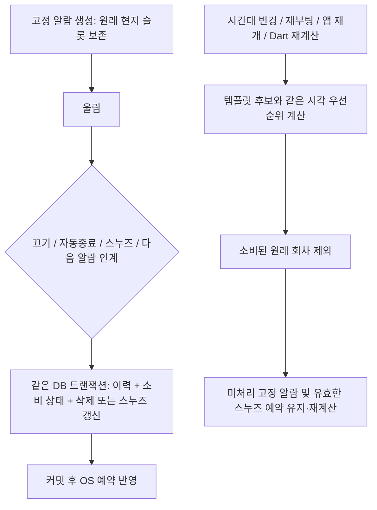

# 시간대 변경 시 종료 알람 재생성 방지 — 수정 결과

상태: **dev 수정·자동 회귀·에뮬레이터 및 삼성 SRTL 핵심 실기기 검증 완료.** 삼성 Galaxy S26+ Android17에서 실제 배포 DB23→DB28 업데이트·예약/데이터 보존·울림/끄기/스누즈·종료 슬롯 시간대 재생성 방지를 확인했다. PIN/FSI/Doze/재부팅·다른 제조사·최종 출시는 별도다. 사용자 지시에 따라 최종 release 빌드는 하지 않았다.

- 요청: 종료된 고정 알람이 시간대 이동 후 새 ID로 되살아나는 결함을 수정하고 전후·회귀 검증.
- [단계별 재개 원장](시간대_종료알람재생성_수정진행_2026-10-07.md), [최초 조사](교대시계_최신문서.txt).
- 작업 증거: `build/timezone_consumed_alarm_2026-10-07/`. 기존 미커밋 작업 및 기존 검토 원장 보존. commit/reset/clean, 유료 기기·사용자 실기기·운영 prod·PC 종료 조작 없음.

## 원인과 수정 원칙

종료는 알람 행을 삭제하지만 재생성 엔진은 근무표와 현재 시간대의 미래 시각만 비교했다. 이미 끝낸 서울10/5 16:40이 하와이에서는 다시 미래가 되므로 새 ID를 만들 수 있었다. Dart와 Native 모두 같은 결함을 수정했다.

이제 **원래 현지 날짜·시각 + 근무명 + 전날/당일/다음날 옵션**을 고정 회차의 식별자로 사용한다. DB ID나 epoch, 소리 종류는 식별자가 아니다. 새 알람 ID가 달라져도 같은 종료 회차를 다시 만들지 않는다.

DB28에 `alarms.fixed_slot_time`, `alarm_history.fixed_slot_time`과 `fixed_alarm_consumptions`를 추가한다. 원래 슬롯은 DST 보정 전 템플릿 시각이며 스누즈의 실제 재울림 시각과 별도로 유지한다. 가시적인 이력 삭제 후에도 재생성 방지가 유지되도록 기능 상태를 분리했다.

## 과거 DB 버전 불일치 사고 재발 방지

사용자가 재확인한 기존 사고 기록은 `DatabaseHelper.kt`19~46행에 보존돼 있다. Flutter14/Native13에서 실제 migration 누락 가능성, Flutter16/Native15 및 Flutter18/Native17에서 위젯이 실제 근무표를 못 읽고 설정 안내를 반복했던 문제다.

이번에는 `database_service.dart version:28`, `DatabaseHelper.DATABASE_VERSION=28`, `migrations.json targetVersion:28`을 함께 맞췄다. `checkDartKotlinSync`를 유지하고 실제 migration SQL·repair·신규 설치 schema를 함께 검증했다. Native 먼저 열기, migration 중간 실패 롤백, 반복 열기, 미래 버전 DB 거부 검사를 포함한다. 데이터 삭제로 버전 문제를 숨기는 처리는 추가하지 않았다. 참조 주석에 있는 별도 `DB_스키마_변경_가이드.md` 파일은 현재 트리 검색에서 발견되지 않았으므로 읽었다고 주장하지 않는다. 확인 근거는 보존된 사고 주석, 현행 migration/동기화 검사, G0 실제 실행 결과다.

## 확정 정책

| 상황 | 동작 |
|---|---|
| `swiped`, `timeout`, `snoozed`, `snooze_skipped_existing_alarm`, `superseded_by_next_alarm` | 원래 고정 회차를 소비한 것으로 기록 |
| 설정 변경으로 교체된 `superseded` | 소비 아님. 정상 재계산 허용 |
| 울리기 전 취소 `cancelled_before_ring` | 기존 개별 skip override 정책 유지 |
| 스누즈 | 원래 회차 부활 차단, 스누즈 ID와 절대 재울림 시각 보존 |
| 소리 종류만 변경 | 같은 종료 슬롯을 되살리지 않음 |
| 다른 날짜·시각·근무명·day_offset | 별도 회차. 정상 생성 |
| 여러 템플릿이 같은 시각에 기여 | 기존 우선순위 승자를 선택한 뒤 소비 필터 적용. 낮은 우선순위로 종료 슬롯을 채우지 않음 |
| 화면의 전체 알람 이력 삭제 | 소비 상태 보존. 삭제 전 신뢰할 수 있는 구 이력을 먼저 전환 |
| 전체 근무표 초기화 `resetSchedule:true` | 소비 상태도 삭제. 명시적으로 새 사용 이력 시작 |
| 구 백업/새 백업/반복 복원 | 소비 상태 자연키 병합, 기존 상태 유지. 진행 중 스누즈 원본과 목표 시각 보존 |
| DB 쓰기 실패 | 종료·소비 기록·행 삭제/스누즈 변경을 함께 롤백. 생성 중 읽기 실패를 빈 소비 목록으로 간주하지 않음 |

구 이력은 원래 타입 정보가 없으므로 아무 종료 이력이나 차단 근거로 쓰지 않는다. 생성 로그 `source=auto`와 동일 ID·원래 저장 날짜/시각·근무명·offset이 맞는 경우만 기존 고정 회차로 인정한다. 삭제된 원터치의 `custom_preset`, 일반 수동 이력, ID만 우연히 같은 이력은 제외한다. 새 회차에는 명시적인 원본 슬롯을 남긴다. 같은 ID·슬롯·근무·offset에 auto 이외 생성 로그도 있으면 구 이력은 모호하므로 소비 차단에 사용하지 않는다. 이 경계의 실제 DB 재현 FAIL 후 Dart/Native 조회와 migration28 backfill에 동일한 보수적 조건을 적용했다.

백업 병합에서는 새 소비 테이블의 자연키를 JSON tuple로 인코딩한다. 기존 빈 문자열 연결 방식은 근무명 `Night-`/offset+1과 `Night`/offset-1을 같은 키로 오인할 수 있었고, 실제 복원 재현 FAIL → 수정 후 PASS로 검증했다. 다른 기존 이력 테이블의 병합 규칙은 변경하지 않았다.

## 변경 파일

- `assets/db/migrations.json`, `DatabaseHelper.kt`, `database_service.dart`: DB28 추가·비파괴 migration/repair, 종료 원자성, 이력 삭제와 전체 초기화의 구분, 근무명 참조/rename에 소비 상태 포함.
- `FixedAlarmOccurrence.kt`, `fixed_alarm_occurrence.dart` 신규: Native/Dart의 회차 식별·구 이력 전환·소비 상태 조회/기록 공통 정책.
- `AlarmRefreshEngine.kt`, `alarm_generation_service.dart`: 소비 상태를 같은 트랜잭션에서 읽고 생성 후보 필터링. 기존 행은 ID/예약을 바꾸지 않고 원본 슬롯만 보강. Native refresh 정책 버전3.
- `AlarmActionHelper.kt`, `alarm.dart`: 종료/스누즈 이력과 모델에 원본 슬롯 전달.
- `onboarding_screen.dart`: 별도 생성 경로를 공용 DB 재생성 함수로 통합, 커밋 후 OS 반영.
- `backup_policy.dart`, `backup_validator.dart`, `restore_coordinator.dart`: 소비 상태 백업·검증·병합, 구 백업 이력 전환, 구 이력의 null 원본 보강, custom의 잘못된 고정 원본 차단.
- `TimezoneConsumedAlarmTest.kt`, `timezone_consumed_alarm_test.dart`, `full_audit_critical_test.dart`, `alarm_dst_test.dart`, G0 Dart/Native: 회귀 추가. 기존 v27 기대 파일은 유지하고 v28 기대값 별도 추가.
- `DevTimezoneAudit.kt` 및 dev 테스트 instrumentation: 빈 전용 에뮬레이터에서만 실행하는 무음 알람 fixture. 제품 APK에 포함되지 않음.
- `tools/check_critical_release.ps1`: 새 Dart/Native 시간대 회귀를 필수 실행 목록에 포함. 사용자 최종 지시에 따라 `-Build`는 debug+web, 명시 요청을 받은 `-Build -Release`만 release 추가. PowerShell AST 구문검사 PASS. AGENTS.md에도 지침 보존.

## 전후 자동 검증

| 검사 | 결과·근거 |
|---|---|
| 수정 전 Dart 실제 SQLite 재현 | 종료 슬롯 재생성 FAIL / 미처리 정상 생성 대조군 PASS (`before_dart.log`) |
| 수정 전 Native 실제 SQLite 재현 | 종료 슬롯 재생성 FAIL / 대조군 PASS (`before_native_repro.log`, XML). 첫 fixture 준비 실패와 구분 |
| 수정 후 확장 Dart | 203 PASS (`regression_dart2.log`): G0/G1, 시간대16, DST, 스누즈·백업, 초기화, onboarding |
| 수정 후 Native | 27 PASS (`regression_native2.log`): G0 15 + 시간대7 + Refresh H2 5. XML 사본 보존 |
| 백업 자연키 충돌 수정 전 | 실제 복원에서 한 회차 누락 FAIL (`backup_key_before.log`) |
| 최종 백업 보완 후 관련 회귀 | 60 PASS (`backup_key_after.log`): full_audit + 시간대 + 스누즈 백업, 반복 복원 포함 |
| 필수 실행기 첫 완료 | `critical_build.log` exit0. Flutter108+66, Native 필수 검사+G0, dev debug/release APK, 공개 웹 빌드 |
| 백업키 보완 직후 중간 실행 | `critical_build_final.log`: Flutter108+66, Native 필수/G0, dev debug PASS 후 release 단계 사용자 요청 중단(exit1). 전체 실행기 완료 PASS로 기록하지 않음 |
| 구 이력 보완 후 최종 Dart 회귀 | **205 PASS**, `regression_dart_final.log` |
| 최종 Native 회귀 | **111 PASS + G0 이관15 PASS**, `final_native_suite_xml/`, `final_g0_xml/` |
| 최종 필수 실행기 | **exit0**, `critical_debug_final.log`: Flutter108+67, Native111+15, devdebug·공개웹 PASS. release 실행 없음 |
| 분석 | `analyze_source.log`: error0/warning0/info633, exit0. 마지막 보완 `analyze_final_delta.log`도 error0/warning0/info20, exit0 |
| 공백 검사 | `git diff --check` 실제 exit0. Windows CRLF 경고와 구분 |

G0는 v27→28 원본 데이터 보존·신규 설치 schema 일치·구 이력 전환·중간 SQL 실패 원자적 롤백·반복 open·미래 버전 DB 거부를 확인했다. DST는 nominal02:30이 실제03:30으로 보정돼도 원래 슬롯을 소비하도록 전날/당일/다음날을 검사했다. DB 소비 기록 실패 주입으로 삭제·스누즈·이력이 부분 커밋되지 않는지 확인했다. 기존 G1의 DB/OS 반영, 재시도, 알람 인계 회귀도 함께 실행했다.

검사 실패 로그는 삭제하지 않았다. fixture/미래 버전 기대값을 갱신하는 과정의 setup 실패, 첫 root 분석에서 build에 보관한 옛 소스까지 분석한 결과는 제품 결함 재현/최종 제품 분석과 구분한다. WebAssembly dry-run 경고는 이번 JS 웹 빌드 실패가 아니다.

## 격리 에뮬레이터 통합 검증

새 AVD `ShiftBell_TZ_20261007`, Android33/ranchu, serial `emulator-5580`. prod/dev 미설치 상태 확인 후 devdebug+dev 테스트 APK만 설치. 사용자 기기 시간대는 변경하지 않았다.

실제 OS 예약으로12:47 무음 ID1을 울리고1분 자동 종료. 미처리 대조군은13:17 ID2. 이후 **소비1/이력1/생성로그2/남은ID2 하나**를 DB에서 확인하고, PendingIntent ID와 AlarmManager `origWhen`을 연결해 실제 예약 epoch까지 비교했다. SQLite 사본은 integrity_check 통과.

| 단계 | 정상 ID2의 기대 epoch(ms) | 판정·증거 |
|---|---:|---|
| 서울에서 자연 울림·timeout 후 | 1791346620000 | PASS `ended_seoul` |
| Honolulu: 같은 슬롯이 다시 미래가 됨 | 1791415020000 (+19h) | PASS `honolulu_delivered`, 종료 슬롯 재생성0 |
| 재부팅: 이 AVD는 GMT로 부팅 | 1791379020000 (+9h) | PASS `honolulu_reboot`의 **실제 GMT** 기준. Honolulu 유지 검사로 오기 금지 |
| 서울 복귀 | 1791346620000 | PASS `seoul_return` |
| Shanghai: 날짜는 유지, 시각만1시간 뒤로 | 1791350220000 (+1h) | PASS `shanghai`, 종료 슬롯 재생성0 |
| 최종 서울 복귀 | 1791346620000 | PASS `seoul_final` |

`emulator/` 아래 각 단계에 DB/이력/소비 상태, logcat, AlarmManager, PendingIntent, assertions.json을 보존한다. seed는 실제 JSON 결과를 반환하며 호스트가 추가 instrumentation 출력 문구를 잘못 요구한 실패는 중복 seed 없이 DB/OS로 확인했다.

Honolulu 변경 직후 두 스냅샷은 시스템 broadcast가 앱에 전달되기 전이라 이전 epoch를 관찰했다. 전체 broadcast/logcat으로 약20초 전달 지연을 확인했고, TIMEZONE_CHANGED 수신·refresh 완료 후에도 동일한 엄격한 예약 비교를 수행해 PASS했다. 이 중간 관찰을 삭제하거나 즉시 갱신 PASS로 바꾸지 않는다.

마지막 Dart 백업키 보완 후 APK는 후속 최종 체크포인트에서 설치/hash/추가 검증 여부를 기록한다. 위 행들은 백업키 보완 전 APK의 Native 시간대 로직 검증이며 이후 Native 실행 코드 변경은 없다.

## 남은 위험과 되돌리기

- 변경 위험은 **중간**: 제조사별 화면 코드가 아니라 생성·종료·DB·복원 공통부에 걸친다. 가장 중요한 회귀는 미처리 정상 알람 누락이다. 대조군·스누즈·설정 교체·이력 삭제·복원·실패 롤백을 포함해 확인했다. 근거 없는 발생률 %는 제시하지 않는다.
- 과거 이력에 원래 타입/생성 근거가 없거나, DST gap 이전 템플릿 시각이 기록되지 않았다면 원본을 확정할 수 없다. 정상 알람을 잘못 막지 않기 위해 추정 차단하지 않는다. 신규 회차는 명시 슬롯으로 보호한다.
- 이미 다른 버전에서 만들어진 잘못된 과거 예약을 전부 탐색해 지우는 기능을 새로 추가한 것은 아니다. 이번 핵심은 재생성 방지이며 기존 dev의 시간대 복귀 후 지난 OS 예약 정리 정책은 유지한다. 사용자 사건의 잘못된 예약은 최초 조사 당시 이미 사라진 상태였다.
- 최초 작성 시 삼성/다른 제조사 실기기에서는 미검증이었다. 이후 삼성 SRTL 핵심 검사는 아래 추가 결과로 완료했고, 다른 제조사 검사는 남아 있다. 자동/에뮬레이터 PASS를 삼성 PIN 잠금·FSI·OEM 절전 PASS로 취급하지 않는다. 이 작업에서 FSI/채널/오버레이 UI 정책을 다시 변경하지 않았다.
- DB28이므로 **DB28 위에 DB27 APK만 덮어쓰는 되돌리기는 금지**. 기존 DB·환경 사본이 있는 격리 환경에서는 원본 소스/구 APK와 함께 원본 DB를 복구한다. 새 사용 데이터가 생겼다면 먼저 백업하고, 별도 비파괴 후속 수정으로 처리한다.
- 작업 전 소스 사본·hash 및 `task_only.diff`/최종 소스 목록을 확인한다. 저장소 전체 reset/checkout으로 이전 dev 작업을 없애지 않는다.

## 실기기를 연결할 때 후속 검사

현재 개발·자동 검사에 사용자 기기는 필요하지 않았다. 출시 전 삼성 확인은 운영 prod 알람이 없는 전용 기기 또는 명시적으로 전체 시간대 변경을 허용한 기기에서 한다. 유료 기기 사용은 별도 승인 대상이다.

1. 변경 전 DB·알람 설정·실제 OS 예약·자동 시간대 설정을 보존. DB28 업그레이드 후 기존 미래 알람 수/시각/ID 및 스누즈 비교.
2. 무음 고정 알람의 끄기, timeout, 즉석 스누즈를 각각 실행. 종료 원본 재생성0, 스누즈는 선택한 경과시간 유지.
3. 서울→Honolulu→서울 및 Shanghai 왕복. 모든 시스템 변경 처리 후 종료 슬롯0, 미처리 미래 슬롯의 현지 시각/OS epoch 일치. 새 ID 부활·누락·중복 예약은 FAIL.
4. 재부팅 후 같은 조건 확인. PIN 잠금/FSI 검사가 필요하면 기존 P0 회귀기준과 사용자 잠금 해제 협조 절차를 따른다.
5. 시간대·자동 시간대·테스트 알람·권한/볼륨 설정 원복을 확인하고 실기기 결과는 별도 원장에 기록한다.

## 재개 지시

먼저 이 문서 최상단과 [단계별 원장](시간대_종료알람재생성_수정진행_2026-10-07.md)의 마지막 체크포인트를 읽는다. 최종 체크포인트에서 실행 중 작업 유무를 확인하고 중복 실행하지 않는다. 기존 실제 검증 결과를 추정으로 승격하지 않는다. 최종 APK와 설치본 hash가 다르면 어느 코드로 검사했는지 분리한다. 제품 수정이 추가되면 해당 경계의 회귀를 다시 수행한다. 유료/운영 실기기 조작과 PC 종료는 자동으로 이어서 하지 않는다.

## 사용자 최종 빌드 지침과 진단

- 2026-10-07: 사용자가 요청하기 전 release 빌드 금지. 이번 기능 검증은 devdebug로 마무리한다. 기존 `-Build`의 묶음 실행 때문에 불필요하게 release를 반복한 점을 설명하고 진행 중 빌드를 중단했다. 최종 release 산출물 완료를 주장하지 않는다.
- 진단 당시 PC 메모리 약6GB/free410MB, Gradle R8 컴파일 스레드 진행 확인. 빌드 취소 및 작업 소유 GradleDaemon 종료 후 free약3GB. 에뮬레이터 재검사는 빌드와 직렬 실행한다.
- 최종debug 업데이트/hash 일치 및 `final_apk_seoul` PASS 후 Honolulu 재검사는 OS 갱신 대기 제한을 넘었고 logcat 조회도20초 timeout이었다. 성공으로 덮지 않고 재실행 결과를 따로 보존한다.
- 검사 대기 중 정상 대조군13:17 슬롯이 지났다. 이후 서울 복귀 검사에서는 지나간 OS 예약이 없어야 하며, 소비된ID1 부활0 및 미처리ID2의DB행 보존을 별도로 판정한다. 미래인 GMT/Honolulu/Shanghai에서는 원래ID2와 해당 시간대epoch가 정상 예약돼야 한다. 기존 미래 대조군 검사 기대값을 임의로 완화하지 않고 별도 `expired` 검사로 기록한다.

## 구 이력 모호성 추가 보호

`ambiguous_history_before.log`의 TZ13은 auto/custom_preset가 같은 ID·슬롯을 공유했던 구 백업 상황에서 정상4개 중3개만 생성되는 실패를 재현했다. 원본이 불확실한 경우 정상알람을 막지 않도록 NOT EXISTS(non-auto 완전일치 로그)를 Dart/Native 조회와 migration28에 함께 적용했다. explicit 원본이 있는 신규 회차는 그대로 보호한다. G0 양쪽에서도 모호한 근무의 기록은 backfill하지 않고 확실한 원래 근무만 보호하는지 검사한다.

`regression_dart_final.log` **205 PASS**(G0/G1/시간대17/backup5/DST/스누즈/초기화/onboarding 포함). Native 시간대 회귀는8개로 확대했다. 필수 최종 실행은 `critical_debug_final.log`이며 release 없이 수행한다. 이전 에뮬레이터 PASS의 APK와 구 이력 추가 보완 후 APK는 해시로 구분한다.

## 최종 완료 체크포인트

- 최종 코드: 모호한 구 이력 보호까지 포함. 제품 수정 후 Dart205, 필수Flutter108+67, Native111+G0 15, devdebug·공개웹 빌드 PASS. `critical_debug_final.log` exit0, release 실행 없음.
- 최종 APK `build/app/outputs/flutter-apk/app-dev-debug.apk` SHA256: `8fcad15476a9bc09b66b3d988adcec7120388e6efbacea1c35803790504c10c7`. 설치 파일과 일치(`emulator/guard_final_installed_hash.json`). 이전164c...와79fb...는 중간 검증본이다.
- 이 최종 APK의 추가 통합 검사: `guard_final_gmt` 정상ID2 epoch1791379020000 PASS → `guard_final_honolulu` epoch1791415020000 PASS → `guard_final_seoul` 지난ID2 OS예약0 PASS. 전 과정 종료ID1 재생성0, 소비1/이력1/생성로그2 유지. 실제SQLite/AlarmManager/PendingIntent를 대조했다.
- 동시 release 빌드 중의 ADB timeout 이후, 빌드 종료·메모리 회수·전용 에뮬레이터 재실행 상태에서는 최종왕복이 정상 완료됐다. 당시 대기 초과 기록을 지우지 않고 이전단계 관찰로 보존한다.
- 전용 에뮬레이터 Seoul 복귀 확인 후 종료(`emulator/cleanup.json`). 테스트 데이터/소스/검사 증거는 보존. 사용자 실기기·운영 prod·PC 종료 조작 없음.
- 재개할 실행 중 빌드/검사 없음. 다음은 승인된 삼성 전용 실기기의 확인이며, 기존 PIN/FSI 기준은 별도 원장을 따른다. release는 사용자 명시 요청 전 금지.
- 전체 결과 `build/timezone_consumed_alarm_2026-10-07/validation_summary.json`, 소스56개/hash, 이전검증본 사본, 전후실패/PASS 로그를 보존했다. 기존 미커밋 작업과 과거 검토 원장은 유지했다.

## 삼성 SRTL 실제 배포 DB23→28 추가 확인

[실기기 검사 원장](삼성SRTL_DB23_DB28_실기기검사_2026-10-07.txt)에 범위·증거·한계를 기록했다. 배포 APK와 동일 패키지·인증서·UID를 유지한 prod debug 업데이트로 실제 DB23→28을 확인했다. 기존 예약10/10 보존, 메모·OT·구 종료 이력 보존, 실제 무음 울림/끄기/5분 스누즈 재울림/자동종료, Honolulu·Shanghai·Seoul 왕복의 종료 슬롯 부활0 및 DB/OS 일치, 프로세스 재실행 PASS. release 빌드와 Play 배포 검사는 하지 않았다.
